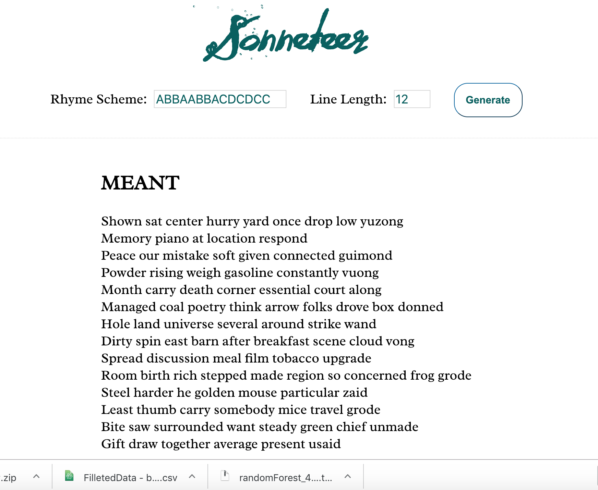

# Sonneteer

Sonneteer generates sonnets! Each line is a perfect Alexandrine of 12 syllables. Currently each sonnet has the rhyme scheme ABBA, ABBA, CDC, CDD. But it is a work in progress! Soon users will be able to choose their own rhyme schemes!!!

### Technologies Used

The app is built in Node and EJS. I also used a rhyming dictionary API, and the NPM packages [syllable](https://www.npmjs.com/package/syllable) and [random-words](https://www.npmjs.com/package/random-words). Testing (still in progress) is in Jest.

To run on your machine, clone the repo, `npm install`, `npm start` and navigate to localhost:3000.

Alternatively, experience the app on Heroku!
